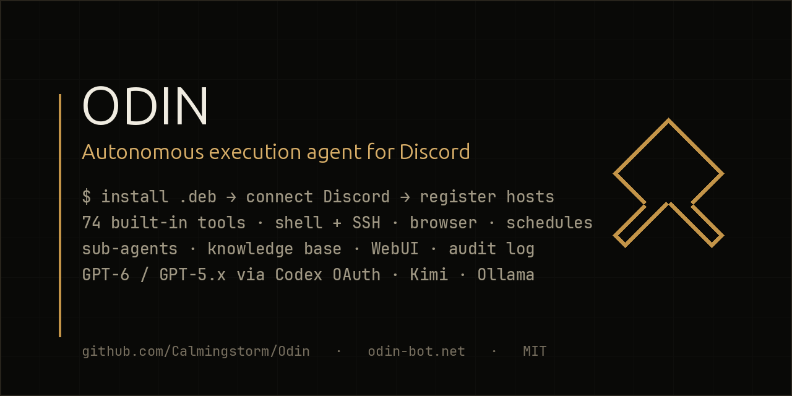
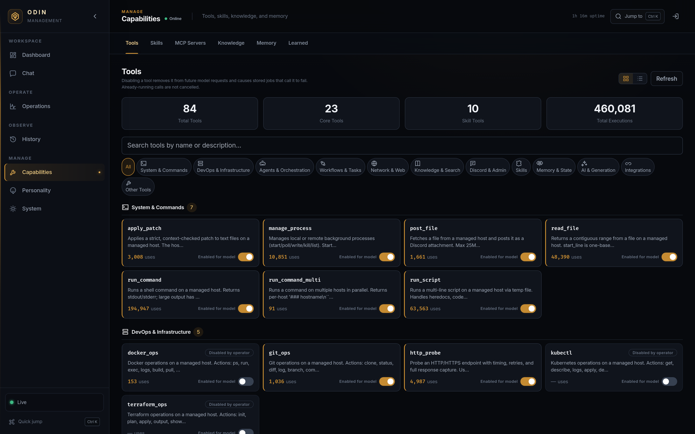
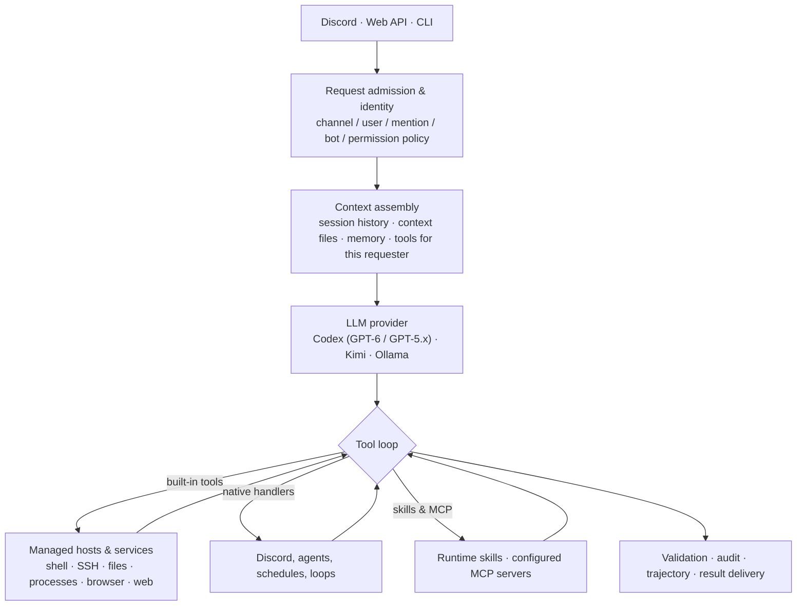

<p align="center">
  
</p>

<h1 align="center">Odin</h1>

<p align="center">
  <a href="https://github.com/Calmingstorm/Odin/actions/workflows/test.yml"></a>
  <a href="https://github.com/Calmingstorm/Odin/actions/workflows/ui.yml"></a>
  <a href="https://github.com/Calmingstorm/Odin/releases/latest"></a>
  <a href="https://github.com/Calmingstorm/Odin/releases/latest"></a>
  
  <a href="LICENSE"></a>
</p>

<p align="center">
  <a href="https://odin-bot.net">Website</a> ·
  <a href="https://odin-bot.net/install">Install guide</a> ·
  <a href="https://odin-bot.net/docs">Operating reference</a> ·
  <a href="https://calmingstorm.github.io/Odin/">Developer hub</a> ·
  <a href="https://github.com/Calmingstorm/Odin/releases">Releases</a> ·
  <a href="https://github.com/Calmingstorm/Odin/discussions">Discussions</a>
</p>

Odin is a self-hosted execution agent for Discord. Ask it to do something in a channel and it does the work: shell commands on the hosts you registered, repository changes, service operations, browser sessions, scheduled jobs, or a fan-out of sub-agents — then reports what actually happened, with an audit record of every tool call it made.

It is built for people who run real infrastructure and want an agent that **executes rather than describes**, inside limits they set: per-user host access, permission tiers, a command governor, secret redaction, and an audit log with optional HMAC tamper evidence.

| | |
|---|---|
| **74 built-in tools** | shell and SSH, files and patches, background processes, browser automation, web, scheduling, sub-agents, knowledge base, memory, email, Docker/Kubernetes/Terraform |
| **Three model backends** | OpenAI Codex over a ChatGPT subscription (GPT-6 and GPT-5.x, multi-account), Kimi, or local Ollama — switch at runtime |
| **Management WebUI** | live execution viewer, agents, loops, processes, schedules, audit, sessions, usage, tools, skills, knowledge, hosts, config, turn state — 211 REST routes behind it |
| **Bounded autonomy** | iteration, lifetime, and nesting limits; durable turn state that survives model-capacity outages without replaying side effects |
| **Tested** | 11,712 tests across 346 files, characterization pins on the tool catalog, API routes, and tool loop |

## What it looks like

*An illustrative exchange — the hostnames are invented, the behaviour is what Odin does.*

> **operator:** the staging API is returning 502s since the deploy — find out why and fix it if it's safe
>
> **Odin:** Probed `https://staging.example.internal/health` → 502 in 40 ms, upstream refused. `systemctl status api-staging` shows the unit flapping since 14:02; the journal ends in `address already in use :8080` — the previous worker was never reaped. Killed the orphan (PID 41822), restarted the unit, health is 200 in 12 ms across five probes. Validation bundle passed 4/4 (service active, port open, HTTP 200, no new errors in 60 s). Audit record `#8813`.

The WebUI shows every tool Odin can reach, how often each has run, and lets you switch any built-in tool off for the model:

<p align="center">
  
</p>

## Quick start

Debian or Ubuntu. The package installs its dependencies during setup, which can take a few minutes:

```bash
curl -LO https://github.com/Calmingstorm/Odin/releases/latest/download/odin_3.93.0_amd64.deb
sudo apt install ./odin_3.93.0_amd64.deb
sudoedit /etc/odin/.env          # DISCORD_TOKEN=...
sudo -u odin /opt/odin/.venv/bin/python /opt/odin/scripts/codex_login.py \
  --credentials-path /var/lib/odin/codex_auth.json --device
sudoedit /etc/odin/config.yml    # set web.api_token; bind web.host to 127.0.0.1 unless it sits behind TLS;
                                 # review permissions.default_tier (template: admin) and tools.hosts
sudo systemctl start odin        # WebUI on the configured web.port (default 3000)
```

The package also grants the `odin` service account passwordless sudo; restrict `/etc/sudoers.d/99-odin-passwordless` before the service is reachable from anywhere you do not control. Then invite the bot, register the hosts it may reach in **System → Hosts**, and ask it for something harmless first. The full walkthrough, including a source checkout for development, is under [Installation](#installation).

## Capabilities

### Systems and software operations

- Run commands and scripts on local or remote managed hosts over SSH.
- Read and write files, manage long-running processes, and transfer generated artifacts.
- Work with Git repositories, Docker, Kubernetes, and Terraform.
- Probe HTTP endpoints and run post-change checks against services, ports, processes, logs, commands, and URLs.
- Use Playwright for rendered page inspection, screenshots, table extraction, form entry, clicks, and JavaScript evaluation.

### Automation

- Run recurring cron schedules, one-time jobs, and webhook-triggered workflows.
- Delegate sequential background workflows with conditional steps.
- Run autonomous monitoring loops with explicit iteration and stop limits.
- Spawn isolated sub-agents for parallel or nested work and collect their results into the parent task.
- Preserve turn state across model-capacity interruptions without automatically repeating interrupted side effects.

### State and retrieval

- Persist channel sessions and compact long conversations against configurable context budgets.
- Store operator-approved personal or global memory notes.
- Search conversation history and the tool audit log.
- Ingest and search a knowledge base using full-text and vector retrieval.
- Record per-turn trajectories, tool use, timing, and model usage.

### Extensibility

- Create, edit, enable, disable, import, export, and invoke Python skills at runtime.
- Configure skills with JSON schemas, dependencies, and operator-managed settings.
- Integrate external systems through webhooks, email, issue trackers, MCP servers, Slack, Grafana alerts, and custom skill code.

### Management interface

The web interface provides grouped views for:

- chat and current system posture;
- active execution, agents, loops, processes, and schedules;
- audit records, sessions, traces, and model usage;
- tools, skills, knowledge, memory, and learned context;
- health, resources, logs, configuration, permissions, host access, and updates.

The API exposes 211 REST routes (pinned in order by a characterization test) plus health, metrics, webhook, WebSocket, and static-interface routes.

## Execution model



For a normal Discord request:

1. The intake pipeline applies channel, user, mention, bot, and permission policy.
2. Odin assembles session history, configured context, and the tools available to that requester.
3. The active provider returns text, tool calls, or both.
4. The tool loop validates and dispatches calls until the request completes or an iteration, time, or cancellation limit is reached.
5. Tool results are recorded and returned to the model for the next step.
6. After a recognized mutation, the tool loop asks the model to run `validate_action` before the final response, retrying the request a bounded number of times; it does not hold finalization indefinitely.
7. The final response and turn trajectory are persisted and delivered to Discord or the API caller.

Odin supports three model backends:

| Provider | Authentication | Notes |
|---|---|---|
| OpenAI Codex | OAuth device or browser flow | Primary provider path; supports account rotation and separate spawned-agent model settings |
| Kimi | Moonshot API key | Alternative hosted provider |
| Ollama | Local or remote endpoint; optional bearer token | Self-hosted provider path |

The provider can be changed through configuration or the web interface. The Codex Advanced panel uses an explicit save action. Codex connection-pool and context-compression changes are saved immediately but require an Odin restart. Provider support does not imply that every model has equivalent tool-calling behavior or context limits.

## Built-in tools

The current release registers 74 built-in tools, 23 of them core tools. The registry is assembled from ordered definition modules under `src/tools/defs/`; tests pin the catalog order and prevent duplicate names.

| Area | Tools |
|---|---|
| Shell and files | `run_command`, `run_script`, `run_command_multi`, `read_file`, `apply_patch`, `generate_file`, `post_file`, `manage_process` |
| Infrastructure | `git_ops`, `docker_ops`, `kubectl`, `terraform_ops`, `http_probe`, `validate_action` |
| Scheduling and workflows | `schedule_task`, schedule management, delegated tasks, autonomous loops |
| Agents | spawn, message, inspect, wait for, collect, and terminate agents |
| Browser and web | web search and fetch, screenshots, rendered page and table reads, clicks, form entry, JavaScript evaluation |
| Knowledge and state | history and audit search, knowledge ingestion and retrieval, memory, lists |
| Skills | create, edit, invoke, import, export, inspect, enable, disable, and delete skills |
| Communication and media | Discord operations, email, PDF and image analysis, image generation |

The complete catalog is defined in [`src/tools/registry.py`](src/tools/registry.py) and [`src/tools/defs/`](src/tools/defs/), and rendered with every parameter in the [tool reference](https://calmingstorm.github.io/Odin/reference/tools) on the developer hub, alongside the [REST API reference](https://calmingstorm.github.io/Odin/reference/api) and an [architecture guide](https://calmingstorm.github.io/Odin/architecture).

## Safety and access control

Odin can change real systems. It should be deployed as an administrative service and configured accordingly.

The implementation includes the following controls:

- **Permission tiers:** `admin`, `user`, and `guest`. The `user` tier excludes arbitrary shell execution and administrative tools, but its allowlist includes limited stateful operations such as list management. The tracked deployment template sets the effective default tier to `admin`; operators should change it if that is not appropriate for their server.
- **Host access policy:** per-user host allowlists and default-host selection, with request-scoped restrictions for API callers.
- **CommandGovernor:** classifies shell commands before execution. Depending on configuration and caller tier, it can reject critical or exfiltration patterns, annotate high-risk commands, or allow an administrator override. The tracked template enables administrator override.
- **Workspace isolation:** local commands run from a dedicated private workspace outside the application and data directories. Local command execution fails closed if that workspace is missing, incorrectly owned, or not mode `0700`.
- **Secret handling:** model input, tool output, attachments, and stored records pass through secret-detection and redaction paths.
- **Network request guards:** browser automation and general web-fetch paths validate destinations and redirect hops to reduce SSRF and DNS-rebinding risk. Individual integration tools may apply narrower policies appropriate to their purpose.
- **Audit logging:** tool calls are written to append-only JSONL records. Optional HMAC chaining provides tamper evidence, and rotation limits unbounded growth.
- **Post-change validation:** recognized mutations are flagged for follow-up validation; the tool loop requests it with bounded retries before finalizing.
- **Web authentication:** bearer-token and session authentication are available for the management API and interface.

These are application controls, not a security boundary equivalent to a virtual machine. Skills execute in the Odin process as trusted plugins. The Debian installer also grants the `odin` service account passwordless sudo by default because host administration is a primary use case; production operators should restrict `/etc/sudoers.d/99-odin-passwordless` to the commands their deployment needs.

The tracked configuration binds the web server to `0.0.0.0` and leaves API authentication disabled when no API token is configured. Before exposing it beyond a controlled network, configure an API token or token identity, transport security, and appropriate network controls.

See [`docs/security.md`](docs/security.md) for the detailed security model.

## Selected operational record

The following examples are drawn from completed operator sessions and repository records. They describe work performed through Odin rather than synthetic capability claims.

- **Repository integration and concurrency safety:** [Calmingstorm/wanderer#2](https://github.com/Calmingstorm/wanderer/pull/2), merged on 2026-08-01, rebased a maintained fork onto upstream and added guarded signature imports, reconciliation previews, transactional updates, and serialization around concurrent graph mutations.
- **Security review and remediation:** during review of a payout-transfer change, Odin identified an unauthenticated execution route, moved execution behind the administrative API and authenticated actor context, updated the API smoke test, reran the project checks, and merged the corrected change.
- **Minecraft release operations:** Odin has prepared and published versioned modpack artifacts, updated AMP-managed servers while preserving worlds and local files, and validated application state, listening ports, mod loading, KubeJS checks, and server tick rate after restart.
- **Infrastructure recovery:** Odin traced loss of apparent audit history to rotation and restart behavior, hardened a backup guard to treat active and rotated audit segments as one store, added JSON and high-water validation, and completed a subsequent Restic backup with the protected data included.
- **Runtime extension:** deployment-specific skills extend Odin for the services an operator actually runs — game-server panels, DNS and cloud providers, release publishing, hardware status — and enforce their own confirmation and validation requirements on top of the built-in tool controls.

Operational results depend on credentials, host access, third-party availability, project state, and the quality of the selected model. Odin records tool outcomes so an operator can distinguish completed work from attempted or interrupted work.

## Installation

### Debian or Ubuntu package

Releases include an amd64 `.deb` package. Download the current package from the [releases page](https://github.com/Calmingstorm/Odin/releases), then install it with APT:

```bash
sudo apt install ./odin_*_amd64.deb
```

The package installs:

| Purpose | Path |
|---|---|
| Application | `/opt/odin` |
| Configuration | `/etc/odin/config.yml` |
| Environment file | `/etc/odin/.env` |
| Persistent data | `/var/lib/odin` |
| Local command workspace | `/var/lib/odin-workspace` |
| Logs | `/var/log/odin` |
| Systemd unit | `/usr/lib/systemd/system/odin.service` |

The package installs the application files and systemd unit. Its post-install script creates the `odin` service account, virtual environment, SSH key, data directories, configuration links, and local command workspace. A new installation is enabled but is not started until credentials are configured. Upgrades preserve configuration and data and restart the service only if it was already running.

### First-time setup

1. Create a Discord application and bot in the [Discord developer portal](https://discord.com/developers/applications). Enable **Message Content Intent**.
2. Set the Discord token:

```bash
sudoedit /etc/odin/.env
# DISCORD_TOKEN=...
```

3. Authenticate Codex, or configure Kimi or Ollama later through the web interface:

```bash
sudo -u odin /opt/odin/.venv/bin/python \
  /opt/odin/scripts/codex_login.py \
  --credentials-path /var/lib/odin/codex_auth.json \
  --device
```

4. Review hosts, permissions, the command workspace, and the web API token:

```bash
sudoedit /etc/odin/config.yml
```

5. Start the service and inspect startup:

```bash
sudo systemctl start odin
sudo systemctl status odin
sudo journalctl -u odin -f
```

The web interface listens on the configured `web.port`, which defaults to `3000`.

### From source

Python 3.11 or newer is required. CI currently runs on Python 3.12.

```bash
git clone https://github.com/Calmingstorm/Odin.git
cd Odin

python3 -m venv .venv
. .venv/bin/activate
pip install -e ".[dev]"

# Optional browser support
pip install -e ".[browser]"
python -m playwright install chromium

cp .env.example .env
# Set DISCORD_TOKEN in .env and review config.yml.

# Local shell tools require a private workspace outside the checkout.
mkdir -p ~/.local/share/odin-workspace
chmod 0700 ~/.local/share/odin-workspace
# Set tools.local_working_dir to this absolute path in config.yml.

python -m src
```

For a source installation using Codex, run `python scripts/codex_login.py --device` to create `data/codex_auth.json`.

## Configuration

Odin loads `config.yml` at startup and supports `${VAR}` and `${VAR:-default}` environment substitution.

Managed execution hosts remain durable under `tools.hosts` in `config.yml`, but
administrators can add, enroll, test, edit, disable, drain, and remove them live
from **System → Hosts**. New SSH targets use pinned public host-key material and
must pass a non-interactive connection test before activation. Existing
`address`/`ssh_user`/`os` entries keep legacy `known_hosts` trust without a boot
migration or config rewrite. Host Access remains a separate authorization
policy, and `tools.default_host` is the explicit fallback for omitted-host
system work; mapping order is never treated as policy.

The Codex model selectors include `gpt-6-astra` for accounts where that model
is entitled. Astra accepts `low` through `max` reasoning effort but rejects
`none`; Odin validates that pair for main, fixed-agent, and per-spawn settings.

Remote `manage_process` jobs are supervised on the target with a one-hour
deadline. Odin shutdown/restart attempts to terminate every tracked remote job;
jobs are not re-adopted after restart, and transport loss is reported as an
unknown outcome rather than a claimed stop.

Important sections include:

| Section | Purpose |
|---|---|
| `discord` | token source, user and channel admission, mention and bot policy |
| `openai_codex`, `kimi`, `ollama`, `llm_provider` | provider credentials, model selection, retry and context settings |
| `tools` | managed hosts, SSH paths, command timeouts, workspace, tool limits |
| `permissions` | default tier and per-user overrides |
| `agents` | nesting, concurrency, iteration, and lifetime limits |
| `sessions`, `context`, `turn_state` | conversation persistence, compaction, context files, suspended-turn recovery |
| `browser`, `image`, `comfyui` | browser and image backends |
| `web`, `webhook` | management API, interface, and inbound events |
| `audit`, `observability`, `usage`, `logging` | audit integrity, health, metrics, usage, and logs |

Markdown files placed under the configured context directory (by default `data/context/`) are included as infrastructure context. Runtime permission overrides and other state are stored under `data/`.

See [`docs/configuration.md`](docs/configuration.md) for the configuration reference.

## Skills

A skill is a Python module that exports a `SKILL_DEFINITION` dictionary and an asynchronous `execute` function. Definitions include a JSON input schema and can optionally declare dependencies and a configuration schema.

Skills can be hot-reloaded and receive a bounded context API for host execution, selected tool calls, HTTP, memory, knowledge, scheduling, and Discord delivery. Default execution limits cover runtime, output size, tool calls, HTTP requests, messages, files, and dependency count.

Skills are trusted code. Local create/edit executes the module before validating its runtime definition for catalog publication. Separate AST validation does not execute code; URL installation additionally applies static validation and prohibited-construct checks before loading. These checks do not provide process isolation or restrict the supplied context's capabilities.

See [`docs/skills.md`](docs/skills.md) for the skill contract and context API.

## Development and testing

Python checks:

```bash
pip install -e ".[dev]"
pytest -q
ruff check src tests
```

Web interface checks:

```bash
npm ci
npm run check
```

`npm run check` validates templates and bindings, runs targeted interface invariants, and builds the Vite output. The generated `ui/dist/` tree is committed; CI fails if it differs from source.

The GitHub Actions test workflow runs:

- the Python suite;
- real Chromium request-guard tests;
- no-new-finding lint and type gates;
- configuration-application classification checks;
- a per-file no-regression coverage gate.

The interface workflow runs the complete JavaScript check and build pipeline. Characterization tests pin behavior at decomposition boundaries such as the tool catalog, API routes, chat tool loop, and autonomous loop.

## Repository structure

```text
src/
  __main__.py             process startup and shutdown
  config/                 schema, loading, and live-apply metadata
  discord/                Discord intake, tool loop, delivery, and session wiring
  tools/                  registry, execution, handlers, safeguards, and skills
  llm/                    Codex, Kimi, Ollama, routing, recovery, and redaction
  agents/                 spawned-agent lifecycle
  scheduler/              cron, one-time, webhook, and workflow scheduling
  sessions/               channel history, persistence, and compaction
  knowledge/              full-text and vector knowledge store
  permissions/            permission tiers and host access
  audit/                   append-only and optionally HMAC-chained audit records
  trajectories/           per-turn execution records
  web/                     management API, chat API, and WebSocket support
  health/                  health, readiness, metrics, web server, and static UI
ui/
  js/pages/               Vue page modules
  js/                     API client and shared interface behavior
  css/                    interface styles
  dist/                   committed production build
packaging/                Debian package metadata and systemd scripts
tests/                    unit, integration, security, and characterization tests
docs/                     configuration, security, skills, and engineering plans
```

## License

[MIT](LICENSE)
